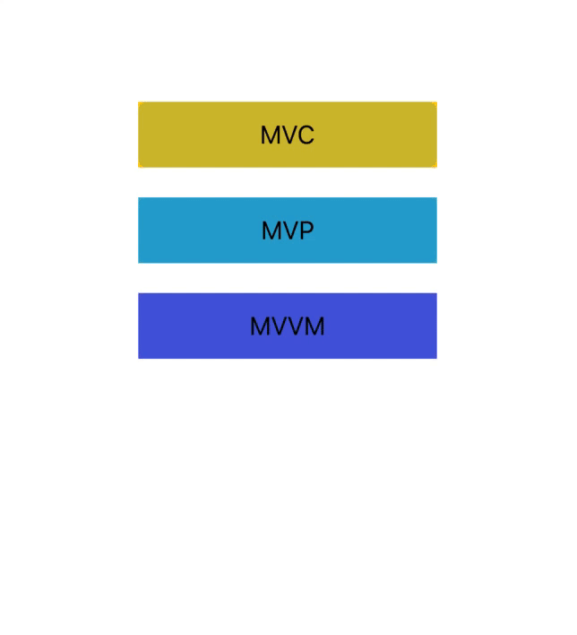
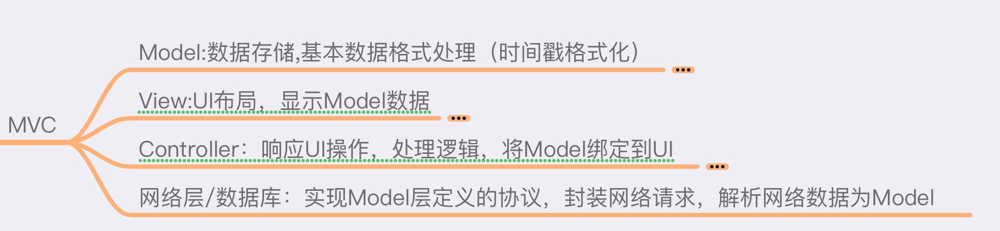
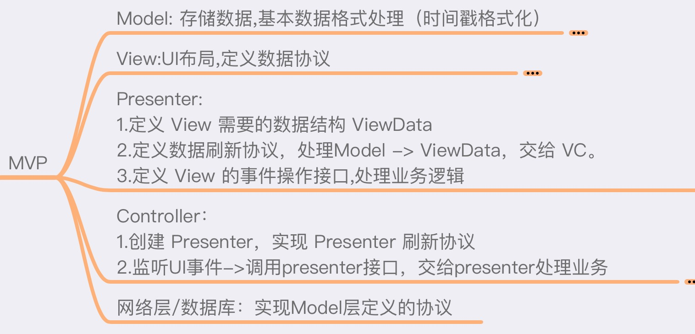
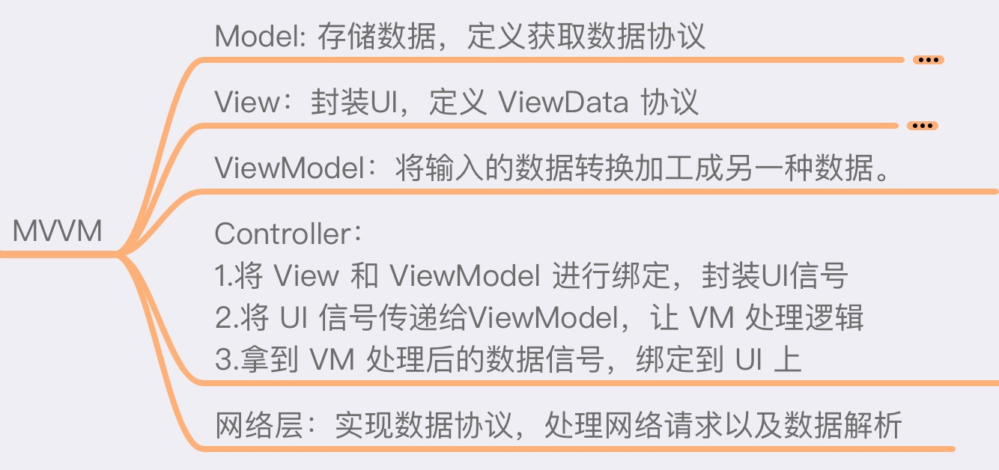

# MVC/MVP/MVVM

- 谈谈个人对这三种架构的理解，本文实现最简单的案例。为了看清逻辑结构，MVVM封装的部分没有考虑内存问题。

### 效果图


- 如上图，需要一个点击事件和一个数据刷新。

- MVC 实现



```swift
UserViewController.swift
// MARK: - 监听事件
extension UserViewController {
    
    // 1.监听事件
    private func setupAction() {
        userView.getInfo.addClick(on: self) { (self) in
            self.getUserInfo()
        }
    }
    
    // 2.处理事件、业务逻辑、刷新UI
    private func getUserInfo() {
        let user = User(name: "张三", age: Int(arc4random()) % 30)
        
        userView.configInfo(user)
    }
}
```


- MVP 实现


```swift
UserViewController1.swift
// MARK: - 监听事件
extension UserViewController1: Userview1Protoco {
    
    // 1.将事件转交给 presenter 处理
    private func setupAction() {
        userView.getInfo.addClick(on: self) { (self) in
            self.presenter.getUserInfo()
        }
    }
    
    // 2.实现 presenter 刷新数据的协议
    func refreshData(_ data: UserViewData) {
        userView.configInfo(data)
    }
}
------------------------
// 数据处理
struct ViewData: UserViewData {
    let user: User
    var name: String { return "姓名：" + user.name }
    var age: String { return "年龄：\(user.age)" }
}

/// Presenter:
/// 1.负责处理业务逻辑
/// 2.负责将处理好的数据，调用刷新UI的协议
class UserView1Presenter {
    private weak var delegate: Userview1Protoco?
    init(delegate: Userview1Protoco) {
        self.delegate = delegate
    }
    
    // 1.提供 UI 处理能力， 处理业务逻辑
    public func getUserInfo() {
        let user = User(name: "李四", age: Int(arc4random()) % 30)
        
        // 2. 拿到数据，处理将数据，调用刷新协议
        delegate?.refreshData(ViewData(user: user))
    }
}

```

- MVVM 实现


```swift
UserViewController2.swift
// MARK: - 绑定信号
extension UserViewController2 {
    private func bind() {
        
        /// 1.获取点击信号
        let input = userView.getInfo.rx.tap()
        
        /// 2.交给 VM 处理信号
        let output = vm.transfom(input)
        
        /// 3.将结果绑定到UIView上
        self.userView.bind(output)
    }
}

----------------------------
UserViewModel.swift

class UserViewModel {
    typealias Input = Observable<Void>
    typealias Output = Observable<UserViewData2>
    
    private(set) var input: Input?
    public var output: Output?
    
    public func transfom(_ input: Input) -> Output {
        self.input = input
        self.output = Output(value: ViewData2(user: User(name: "", age: 0)))
        
        /// 1.处理业务逻辑
        input.subscrib(fireNow: false) {[weak self] _ in
            let user = User(name: "张三", age: Int(arc4random()) % 30)
            self?.output?.value = ViewData2(user: user)
        }
        
        /// 2.返回处理结果信号
        return output!
    }
}

```
